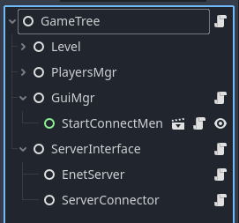

# Multiplayer Basics Workshop for GodotCon Boston 2025
We will start with a sample 2D top down game, and add multiplayer to it. If you get stuck, see the branch `finished-product`.

## Adding Multiplayer
We start with a player that can move around, but in order to get into the castle we need a friend to join our game and help us open the door.

### 1. Set up our Game Tree
For single player games we usually have the player as a node inside of the level. For multiplayer, we want our game level to be seperate from the player, so that we can spawn multiple players.


### 1a. How to test locally?
In order to test multiplayer with only one computer, you can enable the setting for running multiple instances of your game. In the Godot Editor, in the top left menu, go to Debug > Customize Run Instances. 
Check the box to enable multiple instances and set the number to 2 instances. When you run the game next, two windows of your game should pop up.

Note that this project has the tile-instances addon installed, so the two windows should spawn side by side, helpful for rapid prototyping!
You will also probably want to disable the "Embed Game on Next Play" setting in the Game tab of the Godot Editor. 

### 2. Connect the Computers over the Network
To connect from one computer to the other, we will set up a host & client relationship. Our host will create a ENet server and our client will connect to the host.
[ENet](http://enet.bespin.org/index.html) is a library that provides reliable UDP networking. Godot has [wrappers for the ENet library](https://docs.godotengine.org/en/stable/classes/class_enetconnection.html) in its high level multiplayer features.

We will create a Server Interface node that will be home to all the code related to hosting and connecting to the server. The Server Interface node will connect and manage the logic of it's child nodes.
Create a node named EnetServer and a node named ServerConnector. These two nodes will have the logic for hosting a ENet Server, and connecting to an ENet Server.



When the host wants to start their server, through the EnetServer node they create a ENetMultiplayerPeer and call the `create_server(port, max_players)` function on it. They then store the newly created ENet peer in their `multiplayer` [MultiplayerAPI instance](https://docs.godotengine.org/en/4.4/classes/class_multiplayerapi.html#class-multiplayerapi). 

⚠ NOTE: To allow clients to connect from other networks (not LAN) you will need to port forward the port you are hosting on.

When a client wants to join the server, through the ServerConnector node they also create a ENetMultiplayerPeer and call the peer's `create_client(host_ip, port)` function. Once the multiplayer peer's client is created, the client will start connecting to the host's ip and port. 

Also through the ServerConnector node, we will connect to signals coming from the MultiplayerAPI instance. We will listen for the `connection_failed` and `connected_to_server` signals, so we can respond when we fail or succeed in connecting.

For our first test, we will print out in the console to see when we start hosting, start joining, and have successfully connected. The console output should look like this:
```
Server started on port: 25026
Connecting to server at address: localhost:25026
Connected to Server!
```

### 3. Spawn players for each client
Now that we know we can connect to each other, we want to be able to spawn a player for each person to play as.

We can use the `MultiplayerSpawner` node to spawn nodes in the scene tree, across all connected clients. 
Add a MultiplayerSpawner node to the GameTree. For the MultiplayerSpawner's spawn path, set it to spawn nodes under the PlayersMgr node.
We need to tell MultiplayerSpawner which scenes it is allowed to spawn.
Add the `entities/player.tscn` scene to the MultiplayerSpawner's auto spawn list. Also remove any players in the GameTree, as they will be spawned once connected to the server.

Right now, when we host or connect to the server, no players appear. We need to add some logic to our PlayersMgr.
Our PlayersMgr node will be responsible for spawning the player scenes. 
We listen for the `peer_connected` and `peer_disconnected` signals from the MultiplayerAPI instance. When a peer is connected, we instantiate our player scene as a child of PlayersMgr. 
The MultiplayerSpawner will see this new player scene was added, and will replicate it across to all the clients.

Additionally we will want to connect a signal from our EnetServer node, so that when we start hosting our server we can tell PlayersMgr to spawn a player for the host. Otherwise PlayersMgr will only spawn players for clients.

Every client who connects to the server will have a unique **peer_id**. 
When spawning the player characters, we want to make sure that each player node's name matches the peer_id, so we can keep track of what client is controlling which player.

When player nodes are spawned, I store them in a Dictionary, keyed by their peer_id. This way I can find any player's character using their peer_id, for updating variables like health or their appearance.
```
## Dictionary of player nodes, keyed by peer_id
var player_nodes: Dictionary = {}
```

🤔 At this point, if you host and connect to the server, you'll notice it almost works, but with some strange behaviors.
Trying to move the host's player will also move the client's player, and the positions of the players do not match on the host and the client.

We can fix this by [assigning multiplayer authority](https://docs.godotengine.org/en/stable/classes/class_node.html#class-node-method-set-multiplayer-authority) to the nodes that each client controls. 
This will allow us to ignore inputs if the node is not being controlled by the user who is providing inputs.
We can also ignore any physics_process calculations if we know that data will be calculated and syncronized over the network by another client.

### 3a. Assigning Multiplayer Authority
On each player character scene, we want to set the multiplayer authority as soon as they enter the tree.
```
func _enter_tree():
	var peer_id: int = str(name).to_int()
	set_multiplayer_authority(peer_id)
```
You can either add this code directly to your player.tscn scene, or the way I prefer to do it is have player.tscn be a child of a MultiplayerClient scene. 
This way I can seperate the logic of setting multiplayer authority from the logic that drives my player.


It is also helpful to have a label that displays the peer_id of each player in game.


🤔 When moving the host, we also are moving the connected client's player on the host's game. 
When moving the client, we don't seem to see the host's player. Where could the host's player be? (Answer: the host and the client are directly on top of each other).

This can be solved by filtering to only handle physics_process for whichever client has multiplayer authority over that player.
```
func _physics_process(_delta: float):
	if not is_multiplayer_authority(): return
	
	var direction: Vector2 = Input.get_vector("move_left", "move_right",
    "move_up", "move_down").normalized()
  ...
```
Now we can make sure we are only controlling the player we own!
But our connected peers seem to sit still. Let's start synchronizing their movement!

### 4. Synchronizing Movement
To synchronize (AKA share, copy, replicate) variables across the network, we can use the [MultiplayerSynchronizer](https://docs.godotengine.org/en/stable/classes/class_multiplayersynchronizer.html) node.
In our player scene, add a MultiplayerSynchronizer node. You'll notice in the Godot Editor that a Replication tab has appeared on the bottom panel.
This Replication tab is where we define the object properties that we want to sync between all the clients.

Press the "+ Add property to sync" button and in the popup menu, select our Player's CharacterBody2D. You will be presented with all the properties of this node, for now just select position.
The "Player:position" property will be added to the Replication tab, and you will see that it Always replicate.

If you run the game now, you should see the positions of the players being synchronized across the network. Now your friend can help you open the castle door!
